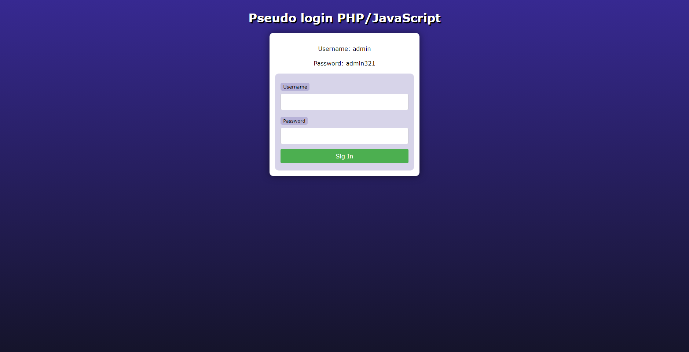

# Pseudo login com HTML, PHP, JS e CSS

# Objetivo - Goal:

PT-BR
O objetivo deste projeto é criar um pseudo login usando HTML, PHP, JS e CSS. O sistema deverá permitir que o usuário insira seu login e senha, e então verificar se as informações são válidas. Se as informações forem válidas, o usuário será redirecionado para uma página de sucesso.

EN-US
The goal of this project is to create a pseudo login using HTML, PHP, JS and CSS. The system must allow the user to enter their login and password, and then check whether the information is valid. If the information is valid, the user will be redirected to a successful page.

# Requisitos - Requirements:

PT-BR
O sistema deverá ter um formulário de login com dois campos: login e senha.
O sistema deverá verificar se os campos de login e senha estão preenchidos.
O sistema deverá verificar se as informações de login e senha estão corretas.
O sistema deverá redirecionar o usuário para uma página de sucesso se as informações forem válidas.

EN-US
The system must have a login form with two fields: login and password.
The system must check whether the login and password fields are filled in.
The system must check whether the login and password information are correct.
The system should redirect the user to a success page if the information is valid.

# O projeto será dividido nos seguintes arquivos - The project will be divided into the following files:

PT-BR
index.html: Página inicial do sistema.
cad.php: Arquivo PHP responsável por verificar as informações de login e senha em conjunto de um script JavaScript.
style.css: Arquivo CSS responsável pelo estilo da página.
img: Pasta de arquivos de img usadas no README

EN-US
index.html: System home page.
cad.php: PHP file responsible for checking login and password information together in a JavaScript script.
style.css: CSS file responsible for the page style.
img: Folder of img files used in the README
